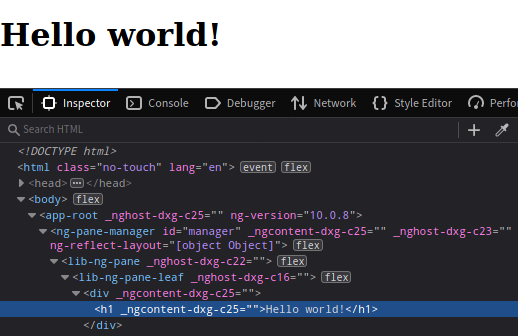
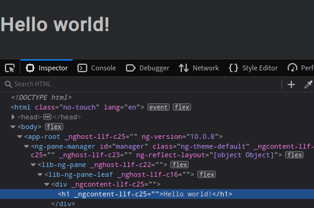
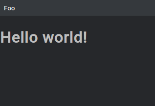
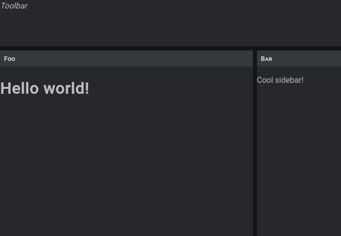

# Example 1: `simple`

This tutorial serves to accompany the code in this folder, going over the basics of getting started with `angular-pane-manager`.

## Create a New Project

To quickly create a new Angular workspace, simply run the following:

```sh
$ ng new my-project
$ cd my-project
```

This will create a new folder named `my-project` and initialize an Angular workspace with the same name inside it.

**NOTE:** It's important that you install SCSS as a style preprocessor for this project if you want to use the default pane manager stylesheet.

## Install `angular-pane-manager`

To begin using `angular-pane-manager`, first install it:

```sh
$ npm add -S @openopus/angular-pane-manager
```

(The actual sample code uses Yarn, but any npm-like package manager should work.)

Next, add the module for the library to the `imports` of the root app module:

```ts
// app.module.ts

import { AngularPaneManagerModule } from '@openopus/angular-pane-manager';
...

@NgModule({
    imports: [
        BrowserModule,
        AngularPaneManagerModule, // Import angular-pane-manager
    ],
    ...
})
export class AppModule { }
```

## Add an Empty Pane Manager

Delete the default template for `AppComponent` and add an empty pane manager to it:

```html
<!-- app.component.html -->

<ng-pane-manager id="manager" [layout]="layout"></ng-pane-manager>
```

...and then add a default value for `layout` to the definition of `AppComponent`:

```ts
// app.component.ts

import { RootLayout } from '@openopus/angular-pane-manager';
...

export class AppComponent {
    layout = new RootLayout<any>(undefined);
    ...
}
```

Before doing anything else, it's important to make sure the pane manager element takes up all available space.  There are several ways to make an element fill the browser viewport, each with different advantages and drawbacks, but for the sake of demonstration the following will suffice:

```scss
// app.component.scss

#manager {
    position: absolute;
    left: 0;
    top: 0;
    width: 100%;
    height: 100%;
}
```

Adding the following to the root stylesheet will also ensure no gaps end up on the edges of the viewport:

```scss
// styles.scss

:root, html, body {
    display: flex;
    flex-flow: column nowrap;
    margin: 0;
    padding: 0;
    width: 100%;
    height: 100%;
}
```

If you build and run the project with `ng serve` and inspect the page in your browser, you should find a `ng-pane-manager` tag with no child content:


Time to fix that!

## Add a Leaf Template

The data structure describing the rendered layout of a pane manager is a tree, with branch (sometimes referred to in the code as "stem") nodes representing tabbed or split containers and leaf nodes representing individual panes.  All leaf nodes reference a template name, which is looked up in a global template dictionary service to produce a rendered component view.

Registering a template with this service is actually quite easy using the `ngPaneTemplate` directive.  Add the following to the template for `AppComponent`:

```html
<!-- app.component.html -->

<div *ngPaneTemplate="let pane named 'foo'">
    <h1>Hello world!</h1>
</div>
```

Now any leaves with the template name `foo` will be rendered with this template.

To actually display a leaf with this template, update the current layout in the constructor of `AppComponent` using a layout builder:

```ts
// app.component.ts

import { LayoutBuilder } from '@openopus/angular-pane-manager';

constructor() {
    const result = LayoutBuilder.empty<any>().build(b => {
        b.add(b.leaf('foo', 'foo', undefined, 'main'));
    });

    this.layout = result.unwrap();
}
```

If all went well, the page should now display the contents of the `foo` template:



The `LayoutBuilder` class is not an essential requirement of constructing a layout (in fact, you can even assemble the layout tree yourself), but it provides trivial error-checking for much of the underlying `PaneLayout` API to make simple layout operations easier.  It wraps the provided callback in a try-catch block and returns a result that has either an `ok` field or and `err` field (if you've ever used Rust's `Result` type you'll be familiar with this paradigm).  If the callback returned successfully the `ok` field will contain the resulting root layout from the builder, but if an error occurred it will be contained in `err` and `ok` will not be present.  Also similar to Rust is the `unwrap` method of the result value, which will either return the layout or throw the error, depending on which is present.

## Styling

Because the pane manager has no styles enabled by default, the next step is to drop in a theme.  To start, add the pane manager stylesheet to the `styles` array in `angular.json`:

```diff
     "styles": [
+        "node_modules/@openopus/angular-pane-manager/assets/styles.scss",
         "src/styles.scss"
     ]
```

**NOTE:** If you have `ng serve` running in the background, you may have to restart it for this change to take effect.

To use the default cosmetic style rules from this stylesheet, add the `ng-theme-default` class to the pane manager component:

```html
<!-- app.component.html -->

<ng-pane-manager id="manager" class="ng-theme-default" [layout]="layout"></ng-pane-manager>
```

And then, if you're not a fan of Times New Roman (or whatever serif font your system uses), you can add the following to the global stylesheet to spice things up a bit:

```scss
// styles.scss

@import url("https://fonts.googleapis.com/css2?family=Roboto:wght@400;500&display=swap");

:root, html, body {
    ...
    font-family: Roboto, sans-serif;
}
```

Et voilà!  The pane contents should now have new colors:



## Add a Header

At this point, the panel being rendered has no header.  Headers are useful not only for giving your panel a visual header bar, but also allowing you to control the titles of tabs, enabling the user to drag panes around to modify the layout, and displaying a close button for closable panels.  To add header information to the `foo` template, you can use the `withHeader` keyword of the `ngPaneTemplate` directive:

```html
<!-- app.component.html -->

<div *ngPaneTemplate="let pane named 'foo' withHeader fooHeader">
    ...
```

It is possible to construct a header object within the directive attribute, but to avoid clutter it may be desirable to write a helper function or store the header in a field, as is done here:

```ts
// app.component.ts

import { headerStyle } from '@openopus/angular-pane-manager';
...

fooHeader = headerStyle('visible', 'Foo', undefined, false);
```

This snippet creates a new header with `Foo` as its title, `undefined` for no icon, and no close button:  (You do not necessarily have to prevent closing this pane, but there is no way to reopen it.)



`PaneHeaderStyle` objects have observable titles and icons, which allow for more advanced behavior when controlled by another component.  The `headerStyle` function provides an easy way to create simpler `PaneHeaderStyle` objects.  For more complex use cases you may opt to construct them yourself instead (for an example of this, check out the `custom-header` demo).

## Add More Panes

At this point, the drag-and-drop features will not work because the pane manager will refuse to detach a lone panel.  To allow it to work, simply add some more panes to the layout:

```html
<!-- app.component.html -->

<div *ngPaneTemplate="let pane named 'toolbar' withHeader toolbarHeader">
    <em>Toolbar</em>
</div>
<div *ngPaneTemplate="let pane named 'bar' withHeader barHeader">
    <p>Cool sidebar!</p>
</div>
```

```ts
// app.component.ts

toolbarHeader: PaneHeaderStyle = headerStyle('hidden', 'Toolbar', undefined, false);
barHeader: PaneHeaderStyle = headerStyle('visible', 'Bar', undefined, false);

constructor() {
    const result = LayoutBuilder.empty<any>().build(b => {
        b.add(b.leaf('foo', 'foo', undefined, 'main'));
        b.add(b.leaf('bar', 'bar', undefined, 'right'));
        b.add(b.leaf('toolbar', 'toolbar', undefined, 'header'));
    });

    this.layout = result.unwrap();
}
```



A couple interesting things to note here are the toolbar header style and the way panes are dropped into the layout.

The toolbar header has its mode set to `hidden`, which acts as if no header information was given, but with an important difference.  If no header is given the information is filled in with default values, because even if the header is not visible the information can still be used in cases such as a tabbed pane, where all children are displayed as tabs regardless of their header display mode.  To make sure this information is correct, it is important to always provide a header style for pane templates.

Pane headers have an additional display mode, `alwaysTab`, that renders the header like a tab bar even if the pane is not contained in a tabbed parent.  This is useful visually if your layout has an emphasis on tabbed editors or viewports, like an IDE or browser.

Finally, you will note that without having to create your own tree structure, the layout has organized itself into one for you just by using the `add` method of the layout builder.  This is thanks to the method `LayoutBase.withChildByGravity` that `add` is calling, which calculates how to insert a pane into the current layout based on its "gravity."  In the above example you can see that the gravity is the fourth parameter passed to the `leaf` method.  `withChildByGravity` looks at both the gravity value of the pane being inserted as well as the gravities of panes already in the layout and uses that information to place the new pane into the layout, adding splits or tabs where necessary.  This makes not only creating new layouts but also dynamically updating existing layouts a breeze, and can be seen in the `dynamic-layout` demo.

And with that, drag-and-drop should be working now.  To see some more advanced use cases, check out the other demos in the folder.  Happy pane managing!