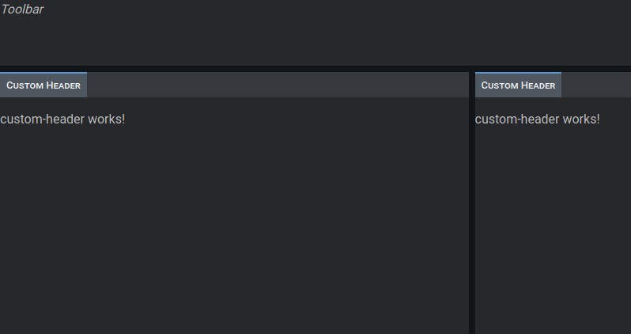
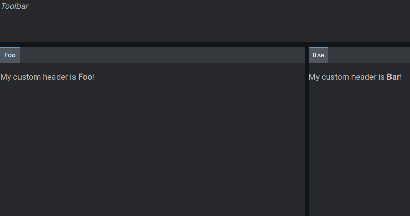

# Example 2: `custom-header`

This tutorial builds on the code of the `simple` demo, extending it with a component that can override the default template header for its pane.

## Create the Component

To add the new component to your project, simply use the Angular CLI:

```sh
$ ng generate component custom-header
```

This will create the necessary files and the module declaration for `custom-header` in your project.

To actually display a custom header, the component needs to output an observable value for the header object itself:

```ts
// custom-header.component.ts

import { Output } from '@angular/core';
import { headerStyle, PaneHeaderStyle } from '@openopus/angular-pane-manager';
import { BehaviorSubject, Observable } from 'rxjs';
...

export class CustomHeaderComponent {
    private readonly $header = new BehaviorSubject<PaneHeaderStyle>(
        headerStyle('alwaysTab', 'Custom Header', undefined, false));

    @Output()
    get header(): Observable<PaneHeaderStyle> {
        return this.$header.asObservable();
    }

    ...
}
```

Subscribing to this output will immediately send the subscriber an event with the current header value.  This is important for making the custom header work, as it will cause the default header to be overridden as soon as the pane template is instantiated.

## Update the Templates

Replace the two leaf templates `foo` and `bar` in the template for `AppComponent` with a single template `custom-header`:

```html
<!-- app.component.html -->

<app-custom-header *ngPaneTemplate="let pane named 'custom-header'"
                   (header)="pane.header = $event"></app-custom-header>
```

Here the template variables are used to pass data from the component back out to the pane manager.  For more information on the template variables available to leaf templates and the types of these variables, check out the interface `LeafNodeContext`.  All leaf node templates are instantiated with a context of this type, and it provides access to some more advanced features.

The `header` field of the `pane` template variable (which is bound to the `$implicit` field of `LeafNodeContext`) provides read-write access to the header of the pane — it can be read to retrieve the current pane header and written to update it with a new value for the current pane, without affecting any other panes.  Here it is written to when a value is available for the `$header` field of `CustomHeaderComponent`.

Now that the templates have changed, the fields `fooHeader` and `barHeader` can be removed and the layout can be updated in the constructor:

```ts
// app.component.ts

const result = LayoutBuilder.empty<any>().build(b => {
    b.add(b.leaf('foo', 'custom-header', undefined, 'main'));
    b.add(b.leaf('bar', 'custom-header', undefined, 'right'));
    b.add(b.leaf('toolbar', 'toolbar', undefined, 'header'));
});
```

You should now have the following:



## Add Custom Titles

To actually customize the title, an `Observable` can be given as the title parameter of the header instead of the string.  Updates to this observable will update the contents of the pane title bar.  While it is possible to change the header style entirely, this is slower as it causes the pane manager to destroy and re-render all DOM elements associated with the header.  However, it has the advantage of being able to update the display mode and closable properties, as these require the header to be re-rendered.  Here, since only the title is changing, a separate observable for the title can be stored in a field of the `CustomHeader` component and passed to the header value:

```ts
// custom-header.component.ts

private readonly $title = new BehaviorSubject<string>('');
// Update the value of $header with the new title
private readonly $header = new BehaviorSubject<PaneHeaderStyle>(
    headerStyle('alwaysTab', this.$title, undefined, false));
```

Then, to allow modifying the title from an HTML template, expose the value of the title subject as a pair of accessors:

```ts
// custom-header.component.ts

import { Input } from '@angular/core';
...

@Input()
get title(): string { return this.$title.value; }

set title(val: string) { this.$title.next(val); }
```

Now the leaf template can be modified to use this new input:

```html
<app-custom-header *ngPaneTemplate="let pane named 'custom-header'; let extra = extra"
                   (header)="pane.header = $event" [title]="extra.title"></app-custom-header>
```

The main thing to note here is the introduction of the template variable `extra`.  This is the third parameter of the constructor for a leaf layout node, and it allows you to pass data directly from the layout data structure to a leaf node template, making them useful for linked instancing.  For this demo, you'll need to add a `title` field to the extra data of the two leaf nodes that are using the `custom-header` template:

```ts
// app.component.ts

b.add(b.leaf('foo', 'custom-header', {title: 'Foo'}, 'main'));
b.add(b.leaf('bar', 'custom-header', {title: 'Bar'}, 'right'));
```

Finally, the template for `CustomHeaderComponent` can be updated:

```html
<!-- custom-header.component.ts -->

<p>My custom header is <strong>{{title}}</strong>!</p>
```



And now you can create multiple different panels using the same template.  The use of the `extra` field can of course be expanded beyond this, and is the primary way to create multiple instances of the same template with different contents (for instance, a text editor template with different files).
