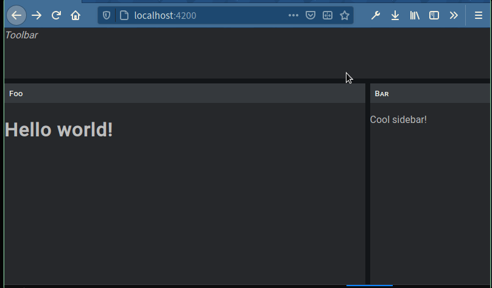
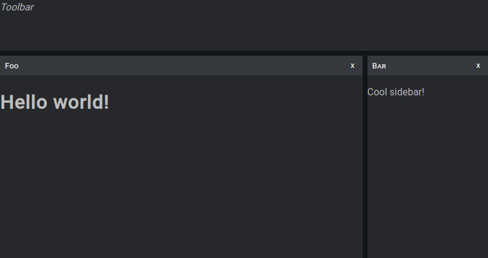
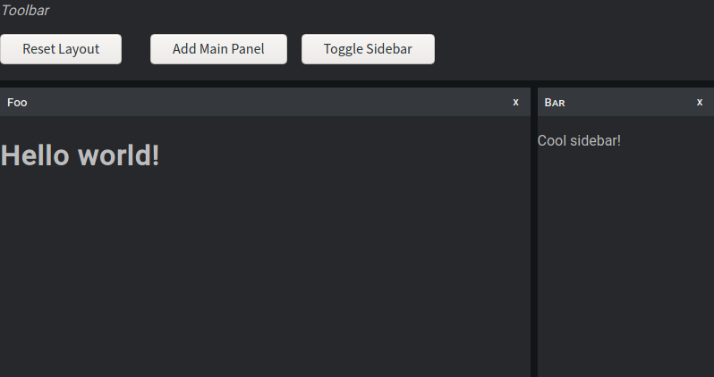
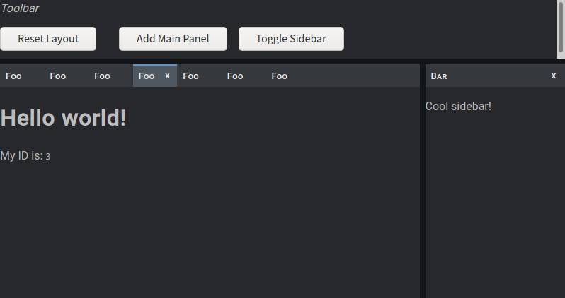
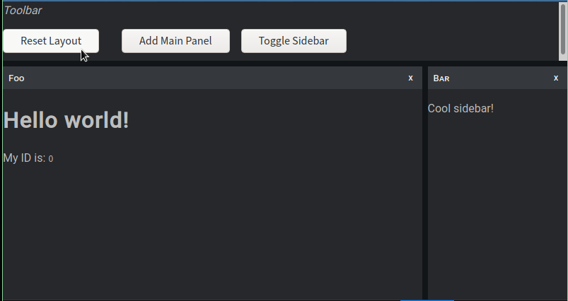

# Example 4: `dynamic-layout`

This tutorial builds on the code of the `simple` demo, extending it with controls to add and remove panes from the layout, as well as the ability to persist the current layout.

## Set Up Persistent Storage

This demo will showcase saving and loading pane layouts across sessions, so you'll need to either use one of the built-in storage APIs or install a third-party wrapper.  The demo code here uses `@ngx-pwa/local-storage`:

```sh
$ npm add -S @ngx-pwa/local-storage
```

## Update the Layout Binding Code

The `layout` attribute of the pane manager component is updated when panes are closed or the layout is rearranged via drag-and-drop operations.  In order to observe these changes, the component provides a `layoutChange` output to allow two-way binding to the `layout` input.  To take advantage of this, change the `layout` field of `AppComponent` to be a getter-setter pair backed by a private field:

```html
<!-- app.component.html -->

<!-- make the binding to layout two-way -->
<ng-pane-manager id="manager" class="ng-theme-default" [(layout)]="layout"></ng-pane-manager>
```

```ts
// app.component.ts

export class AppComponent {
    // Set this to change the layout without saving
    private _layout = new RootLayout<any>(undefined);

    // Set this to change the layout and save it
    get layout(): RootLayout<any> { return this._layout; }

    set layout(val: RootLayout<any>) {
        if (Object.is(this._layout, val)) { return; }

        this._layout = val;
        this.saveLayout();
    }

    constructor() {
        const result = LayoutBuilder.empty<any>().build(b => ...);

        // Change this to use _layout, just for the time being
        this._layout = result.unwrap();
    }

    saveLayout() {
        throw new Error('Not yet implemented');
    }
}
```

If you run the code now, you will notice that the exception is not thrown when a pane is initially dragged — only when it is dropped.  The pane manager suppresses sending an event when a drag starts to avoid storing a layout with a missing pane, since the detached pane does not exist in the layout for the duration of the drag.


## Load the Layout

The first step to saving and loading the layout is to actually load the layout.  To accomplish this, query the local storage for the saved layout in the constructor of `AppComponent`:

```ts
// app.component.ts

import { StorageMap } from '@ngx-pwa/local-storage';
import { LayoutTemplate } from '@openopus/angular-pane-manager';
...

export class AppComponent {
    private static readonly LAYOUT_KEY = 'paneLayout';
    ...

    constructor(private readonly storage: StorageMap) {
        this.storage.get(AppComponent.LAYOUT_KEY).subscribe(template => {
            const result = LayoutBuilder.empty<any>().build(b => {
                b.set(b.loadSimple(template as LayoutTemplate<any>));
            });

            this._layout = result.unwrap();
        });
    }
}
```

This presents an immediate problem — if there is no layout saved, it will crash.


To fix this, add a fallback clause for if the result of the builder is an error:

```ts
// app.component.ts

constructor(private readonly storage: StorageMap) {
    this.storage.get(AppComponent.LAYOUT_KEY).subscribe(template => {
        const result = LayoutBuilder.empty<any>().build(b => ...);

        if (result.err !== undefined) {
            console.warn('Error loading layout: ', result.err);
            this.resetLayout();
        }
        else {
            this._layout = result.ok;
        }
    });
}

resetLayout() {
    const result = LayoutBuilder.empty<any>().build(b => {
        b.add(b.leaf('foo', 'foo', undefined, 'main'));
        b.add(b.leaf('bar', 'bar', undefined, 'right'));
        b.add(b.leaf('toolbar', 'toolbar', undefined, 'header'));
    });

    this.layout = result.unwrap();
}
```

Here, `resetLayout` fills out the layout with the same setup used in the original demo.  Whenever the result fails (which could happen either because there is no saved layout or the format of the saved layout is invalid) the layout will be reinitialized by calling this method.

## Save the Layout

Now that local storage is set up, filling out the `saveLayout` function is easy:

```ts
// app.component.ts

import { saveLayout } from '@openopus/angular-pane-manager';

export class AppComponent {
    saveLayout() {
        this.storage.set(AppComponent.LAYOUT_KEY, saveLayout(this._layout, x => x)).subscribe();
    }
    ...
}
```

However, this function will not get called if panes get resized by the user or they switch tabs.  These events do not change the `layout` field of the pane manager, therefore the binding won't be updated.  To listen for any such minor layout changes, you can bind to the `layoutUpdate` event of the pane manager:

```html
<!-- app.component.html -->

<ng-pane-manager id="manager" class="ng-theme-default" [(layout)]="layout"
                 (layoutUpdate)="requestAutosave.next(undefined)"></ng-pane-manager>
```
```ts
// app.component.ts

import { Subject } from 'rxjs';
import { debounceTime } from 'rxjs/operators';
...

export class AppComponent {
    readonly requestAutosave = new Subject<undefined>();

    constructor() {
        ...

        this.requestAutosave.pipe(debounceTime(500)).subscribe(_ => this.saveLayout());
    }
}
```

Rather than directly calling `saveLayout` from the event handler, it is preferable to instead debounce the stream of events with something like RxJS's `debounceTime` operator, as events such as pane resizes will occur many times a second.  The other advantage to using a dedicated `Subject` for requesting a layout save is that other components or event handlers can trigger an autosave as well using the same mechanism.



## Adding Panes

Since it will be possible to add new panes to the layout, the templates for these panes can now allow them to be closed.  To do this, just change the values of `fooHeader` and `barHeader` to the following:

```ts
// app.component.ts

fooHeader: PaneHeaderStyle = headerStyle('visible', 'Foo', undefined, true);
barHeader: PaneHeaderStyle = headerStyle('visible', 'Bar', undefined, true);
```

Changing the parameter `closable` to `true` both renders a visible close button on these panes and allows middle-clicking the header to close them.



The next step is adding buttons for opening new panes.  Add the following to the toolbar template:

```html
<!-- app.component.html -->

<div *ngPaneTemplate="let pane named 'toolbar' withHeader toolbarHeader">
    <em>Toolbar</em>
    <p>
        <button (click)="resetLayout()">Reset Layout</button>
        <span style="display: inline-block; width: 2rem"></span>
        <button (click)="addMain()">Add Main Panel</button>
        <span style="display: inline-block; width: 1rem"></span>
        <button (click)="toggleSide()">Toggle Sidebar</button>
    </p>
</div>
```

Then, add stubs for the two new click event handlers:

```ts
// app.component.ts

private modifyLayout(callback: (b: LayoutBuilder<any>) => void) {
    const result = LayoutBuilder.from(this.layout).build(callback);
    this.layout = result.unwrap();
}

addMain() {
    this.modifyLayout(b => {
        throw new Error('Not yet implemented');
    });
}

toggleSide() {
    this.modifyLayout(b => {
        throw new Error('Not yet implemented');
    });
}
```

The `modifyLayout` method simplifies using a layout builder to update the currently-rendered layout and save the changes.



Now, there is another problem at hand — the toolbar is the only way to manually reset the layout, but if the user somehow manages to load a layout with no toolbar, then there is no way to reset it.  To remedy this, add the following `if` statement to the layout builder block of the constructor:

```ts
// app.component.ts

import { LayoutType } from '@openopus/angular-pane-manager';
...

// Add the if statement after this line
b.set(b.loadSimple(template as LayoutTemplate<any>));

if (b.root.findChild(c => c.type === LayoutType.Leaf &&
                        c.template === 'toolbar') === undefined) {
    b.add(b.leaf('toolbar', 'toolbar', undefined, 'header'));
}
```

If an invalid layout is successfully loaded, this will give the user the opportunity to reset it if need be.

### `addMain`

In order to add an arbitrary number of `foo` panels to the layout, a few things need to happen.  The primary issue is that if multiple leaf panes have the same ID, the pane manager will only render one of them.  This is because the pane ID is used to track the movement of leaves across a layout, so only one instance of a leaf with a certain ID will ever be rendered.  To remedy this, simply add a field to `AppComponent` to track the next available ID for a `foo` panel, and add a dedicated method to add a new `foo` panel to a layout builder.

```ts
// app.component.ts

private nextMainId = 0;

private makeFoo(b: LayoutBuilder<any>) {
    b.add(b.leaf(`foo${this.nextMainId}`, 'foo', {id: this.nextMainId}, 'main'));

    do {
        ++this.nextMainId;
    } while (b.root.findChild(c => c.type === LayoutType.Leaf &&
                                     c.id === `foo${this.nextMainId}`) !== undefined);
}
...

resetLayout() {
    const result = LayoutBuilder.empty<any>().build(b => {
        this.makeFoo(b);
        b.add(b.leaf('bar', 'bar', undefined, 'right'));
        b.add(b.leaf('toolbar', 'toolbar', undefined, 'header'));
    });

    this.layout = result.unwrap();
}

addMain() {
    this.modifyLayout(b => this.makeFoo(b));
}
```

To allow for the `foo` panels to differentiate themselves, the ID number is passed into the extra template data for each leaf.  To display these numbers, update the template for `foo`:

```html
<!-- app.component.html -->

<div *ngPaneTemplate="let pane named 'foo' withHeader fooHeader; let extra = extra">
    <h1>Hello world!</h1>
    <p>My ID is: <code>{{extra.id}}</code></p>
</div>
```



### `addSide`

Since only one sidebar is generally necessary in an app, the `toggleSide` method should not add another one if a sidebar is currently open.  To accomplish this, add a check to `toggleSide` similar to the ones for `toolbar` in the constructor and `foo${ID}` in `makeFoo`:

```ts
// app.component.ts

toggleSide() {
    this.modifyLayout(b => {
        const childId = b.root.findChild(c => c.type === LayoutType.Leaf && c.id === 'bar');
    });
}
```

This will return either a `ChildLayoutId` object or `undefined`, depending on whether anything was found.  A `ChildLayoutId` is an object containing a parent container and an index, and it is useful for identifying a pane in the layout tree with information on what parent it belongs to and where to find it.  `angular-pane-manager` provides the function `childFromId` to simplify retrieving the child from the parent, but for this use case having a reference to the child itself isn't necessary.  Instead, the index and parent (here referred to as `stem`) can be used to remove the sidebar from the layout, effectively toggling it off.  If no sidebar is found, then a new one can be added:

```ts
// app.component.ts

if (childId !== undefined) {
    b.sub(childId.stem, childId.stem.withoutChild(childId.index).layout);
}
else {
    b.add(b.leaf('bar', 'bar', undefined, 'right'));
}
```

The method `LayoutBuilder.sub` internally calls the method `LayoutBase.transposeDeep`, which recursively searches the tree for the first occurrence of the left-hand argument (using reference equality) and returns a new layout with the occurrence replaced with the right-hand argument.  If no matching node was found, the method fails and returns `undefined`, which will cause the layout builder to fail immediately.

And with that, you can now toggle, add, and remove panes!  This example could be combined with the `custom-header` demo to create an instanced template component that can be added or removed at will from the layout.  The `angular-pane-manager-example` repo contains an implementation of such a component that wraps around a Monaco code editor to provide a pseudo-text-editor interface.


